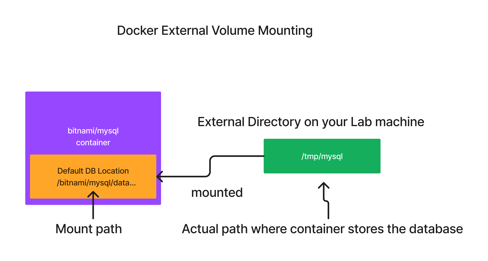

# Day 3

## Lab - Using external volume/directory to store the mysql database (Docker Volume Mounting)

First create a mysql db container that uses the container storage to save the database and tables
```
docker run -d --name mysql --hostname mysql -e MYSQL_ROOT_PASSWORD=root@123 bitnami/mysql:latest
docker ps
docker exec -it mysql sh
mysql -u root -p 
CREATE DATABASE tektutor;
USE tektutor;
CREATE TABLE training ( id INT NOT NULL, name VARCHAR(50), duration VARCHAR(50), PRIMARY KEY(id) );
INSERT INTO training VALUES ( 1, "DevOps", "5 Days" );
INSERT INTO training VALUES ( 2, "Microservices", "5 Days" );
INSERT INTO training VALUES ( 3, "OpenShift", "5 Days" );
SELECT * FROM training;
exit
exit
```
When it prompts for password, you can type 'root@123' without the quotes.

Now let's delete the mysql container, when we delete the container, the tektutor database, trainig table and all records will be lost.
```
docker rm -f mysql
docker ps -a
```

Now let's create another new mysql container
```
docker run -d --name mysql --hostname mysql -e MYSQL_ROOT_PASSWORD=root@123 bitnami/mysql:latest
docker ps
docker exec -it mysql sh
mysql -u root -p 

SHOW DATABASES;
```

Now, you can observe that the tektutor database is missing as we used the container storage and data is lost when the container was deleted.

This is the reason, external volumes are used to persist the data permanently.



Let's create a new mysql container that uses external persistent volume.
```
docker rm -f mysql
mkdir -p /tmp/mysql
chmod 777 /tmp/mysql
docker run -d --name mysql --hostname mysql -e MYSQL_ROOT_PASSWORD=root@123 -v /tmp/mysql:/bitnami/mysql/data bitnami/mysql:latest
docker ps
docker exec -it mysql sh

mysql -u root -p
CREATE DATABASE tektutor;
USE tektutor;
CREATE TABLE training ( id INT NOT NULL, name VARCHAR(50), duration VARCHAR(50), PRIMARY KEY(id) );
INSERT INTO training VALUES ( 1, "DevOps", "5 Days" );
INSERT INTO training VALUES ( 2, "Microservices", "5 Days" );
INSERT INTO training VALUES ( 3, "OpenShift", "5 Days" );
SELECT * FROM training;
exit
exit
docker rm -f mysql
```

Let's recreate another new mysql container mounting the exact same external volume path
```
docker run -d --name mysql --hostname mysql -e MYSQL_ROOT_PASSWORD=root@123 -v /tmp/mysql:/bitnami/mysql/data bitnami/mysql:latest
docker ps
docker exec -it mysql sh
mysql -u root -p

SHOW DATABASES;
USE tektutor;
SHOW TABLES;
SELECT * FROM training;
exit
exit
```

In the above exercise, you would have learned that storing the data to an external volume retains the data permanently and it is accessible from other containers too.


# Ansible

## What is Configuration Management Tool?
- helps in automating software installation and configuration management
- generally done on a an already provisioned machine
- ie. you have already a windows/unix/linux machine either on-prem or on cloud, where you wish to install and configure softwares

## Ansible Overview
- is one of the Configuration Management Tools
- is developed in Python by Michael Deehan ( a former employee of Red Hat )
- Michael Deehan incorporated a company called Ansible Inc, through that company he along with wordwide Opensource contributors, developed Ansible Core as an open source configuration management tool
- The DSL(Domain Specific Language), ie the language in which automation code is written is called the DSL
- The DSL used in Ansible is YAML (Yet Another Markup Language - a superset of JSON[JavaScript Object Notation] )
- it is agentless configuration management 
- the machine where software automation is done is called Ansible Nodes
- On Ansible Nodes, no Ansible specific software runs and monitors, hence it is called agentless
- follows PUSH based architecture
- can only be installed on Unix like OS ie. Unix, Mac, Linux
- the machine where Ansible is installed it is called Ansible Controller Machine (ACM)

- the automation written in YAML is called Ansible Playbook
- Playbook follows a particular YAML structure and schema, hence not all YAML makes a Playbook
- Ansible comes with Ansible Modules
  - Windows Modules for Windows Ansible Nodes
    - Written in PowerShell
    - should have .Net Framework 3.0 or greater
    - WinRM should be installed and active
    
  - Linux/Unix/Mac Modules
    - Written in Python
    - SSH Server should be installed and active

- comes in 2 flavours
  - Ansible Core 
    - open source
    - supports only CLI, there is no GUI
    
  - AWX  ( Community version of Ansible Tower )
    - open source
    - developed on top of Ansible Core
    - supports Web console (GUI)
    - supports user management
    
  - Red Hat Ansible Tower - Paid (Enterprise product - with support from Red Hat)
    - developed on top of opensource AWX
    

## Ansible Alternatives
- Puppet
  - DSL is Ruby
  - follows client/server architecture
  - Pull based architecture
- Chef
  - DSL is Ruby
  - follows client/server architecture
  - Pull based architecture
  
- Salt/SaltStack
## Ansible High Level Architecture


