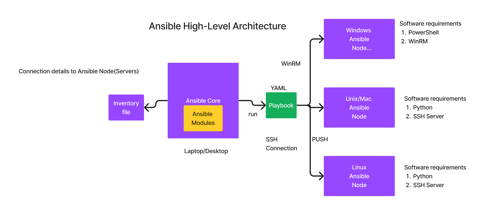

# Day 3

## Lab - Using external volume/directory to store the mysql database (Docker Volume Mounting)

First create a mysql db container that uses the container storage to save the database and tables
```
docker run -d --name mysql --hostname mysql -e MYSQL_ROOT_PASSWORD=root@123 bitnami/mysql:latest
docker ps
docker exec -it mysql sh
mysql -u root -p 
CREATE DATABASE tektutor;
USE tektutor;
CREATE TABLE training ( id INT NOT NULL, name VARCHAR(50), duration VARCHAR(50), PRIMARY KEY(id) );
INSERT INTO training VALUES ( 1, "DevOps", "5 Days" );
INSERT INTO training VALUES ( 2, "Microservices", "5 Days" );
INSERT INTO training VALUES ( 3, "OpenShift", "5 Days" );
SELECT * FROM training;
exit
exit
```
When it prompts for password, you can type 'root@123' without the quotes.

Now let's delete the mysql container, when we delete the container, the tektutor database, trainig table and all records will be lost.
```
docker rm -f mysql
docker ps -a
```

Now let's create another new mysql container
```
docker run -d --name mysql --hostname mysql -e MYSQL_ROOT_PASSWORD=root@123 bitnami/mysql:latest
docker ps
docker exec -it mysql sh
mysql -u root -p 

SHOW DATABASES;
```

Now, you can observe that the tektutor database is missing as we used the container storage and data is lost when the container was deleted.

This is the reason, external volumes are used to persist the data permanently.


Let's create a new mysql container that uses external persistent volume.
```
docker rm -f mysql
mkdir -p /tmp/mysql
chmod 777 /tmp/mysql
docker run -d --name mysql --hostname mysql -e MYSQL_ROOT_PASSWORD=root@123 -v /tmp/mysql:/bitnami/mysql/data bitnami/mysql:latest
docker ps
docker exec -it mysql sh

mysql -u root -p
CREATE DATABASE tektutor;
USE tektutor;
CREATE TABLE training ( id INT NOT NULL, name VARCHAR(50), duration VARCHAR(50), PRIMARY KEY(id) );
INSERT INTO training VALUES ( 1, "DevOps", "5 Days" );
INSERT INTO training VALUES ( 2, "Microservices", "5 Days" );
INSERT INTO training VALUES ( 3, "OpenShift", "5 Days" );
SELECT * FROM training;
exit
exit
docker rm -f mysql
```

Let's recreate another new mysql container mounting the exact same external volume path
```
docker run -d --name mysql --hostname mysql -e MYSQL_ROOT_PASSWORD=root@123 -v /tmp/mysql:/bitnami/mysql/data bitnami/mysql:latest
docker ps
docker exec -it mysql sh
mysql -u root -p

SHOW DATABASES;
USE tektutor;
SHOW TABLES;
SELECT * FROM training;
exit
exit
```

In the above exercise, you would have learned that storing the data to an external volume retains the data permanently and it is accessible from other containers too.


# Ansible

## What is Configuration Management Tool?
- helps in automating software installation and configuration management
- generally done on a an already provisioned machine
- ie. you have already a windows/unix/linux machine either on-prem or on cloud, where you wish to install and configure softwares

## Ansible Overview
- is one of the Configuration Management Tools
- is developed in Python by Michael Deehan ( a former employee of Red Hat )
- Michael Deehan incorporated a company called Ansible Inc, through that company he along with wordwide Opensource contributors, developed Ansible Core as an open source configuration management tool
- The DSL(Domain Specific Language), ie the language in which automation code is written is called the DSL
- The DSL used in Ansible is YAML (Yet Another Markup Language - a superset of JSON[JavaScript Object Notation] )
- it is agentless configuration management 
- the machine where software automation is done is called Ansible Nodes
- On Ansible Nodes, no Ansible specific software runs and monitors, hence it is called agentless
- follows PUSH based architecture
- can only be installed on Unix like OS ie. Unix, Mac, Linux
- the machine where Ansible is installed it is called Ansible Controller Machine (ACM)

- the automation written in YAML is called Ansible Playbook
- Playbook follows a particular YAML structure and schema, hence not all YAML makes a Playbook
- Ansible comes with Ansible Modules
  - Windows Modules for Windows Ansible Nodes
    - Written in PowerShell
    - should have .Net Framework 3.0 or greater
    - WinRM should be installed and active
    
  - Linux/Unix/Mac Modules
    - Written in Python
    - SSH Server should be installed and active

- comes in 2 flavours
  - Ansible Core 
    - open source
    - supports only CLI, there is no GUI
    
  - AWX  ( Community version of Ansible Tower )
    - open source
    - developed on top of Ansible Core
    - supports Web console (GUI)
    - supports user management
    
  - Red Hat Ansible Tower - Paid (Enterprise product - with support from Red Hat)
    - developed on top of opensource AWX
    

## Ansible Alternatives
- Puppet
  - DSL is Ruby
  - follows client/server architecture
  - Pull based architecture
- Chef
  - DSL is Ruby
  - follows client/server architecture
  - Pull based architecture
  
- Salt/SaltStack
## Ansible High Level Architecture


## Recommended editor for Ansible 
You can try Microsoft Visual Studio Code editor.  

You can download the Ubuntu .deb package from your web browser at this url https://code.visualstudio.com/docs/?dv=linux64_deb and install this on Ubuntu as shown below
```
cd ~/Downloads
sudo apt install -y ./code_1.75.1-1675893397_amd64.deb
```

## Generating key pair for your rps user
Press enter key 3 times to accept the defaults.

```
ssh-keygen
```

Expected output
<pre>
 jegan@tektutor.org $ <b>ssh-keygen</b>
Generating public/private rsa key pair.
Enter file in which to save the key (/home/jegan/.ssh/id_rsa): 
Created directory '/home/jegan/.ssh'.
Enter passphrase (empty for no passphrase): 
Enter same passphrase again: 
Your identification has been saved in /home/jegan/.ssh/id_rsa
Your public key has been saved in /home/jegan/.ssh/id_rsa.pub
The key fingerprint is:
SHA256:MA4+EJhvU7FJvZWiCWIPbCnHV3x4DrJTUizTf9lo3pg jegan@tektutor.org
The key's randomart image is:
+---[RSA 3072]----+
|.+o oOo. .       |
|=*+oBoX =        |
|+++++XoX   +     |
|  ++=o.oo = .    |
| . .o.. S+ +     |
|     .    E .    |
|                 |
|                 |
|                 |
+----[SHA256]-----+
</pre>

## Copying your public key into the ubuntu docker image folder
```
cd ~/devops-feb-2023
git pull origin main 

cd Day3/ansible/CustomDockerImageForAnsibleNodes/ubuntu
cp ~/.ssh/id_rsa.pub authorized_keys
```

## Building your custom ansible ubuntu node image
```
cd ~/devops-feb-2023
git pull origin main 

cd Day3/ansible/CustomDockerImageForAnsibleNodes/ubuntu

docker build -t tektutor/ansible-ubuntu-node:latest .
```

Expected output
<pre>
jegan@tektutor.org $ <b>docker build -t tektutor/ansible-ubuntu-node:latest .</b>
[+] Building 29.6s (13/13) FINISHED                                                                                                     
 => [internal] load .dockerignore                                                                                                  0.0s
 => => transferring context: 2B                                                                                                    0.0s
 => [internal] load build definition from Dockerfile                                                                               0.0s
 => => transferring dockerfile: 671B                                                                                               0.0s
 => [internal] load metadata for docker.io/library/ubuntu:16.04                                                                    0.0s
 => CACHED [1/8] FROM docker.io/library/ubuntu:16.04                                                                               0.0s
 => [internal] load build context                                                                                                  0.0s
 => => transferring context: 675B                                                                                                  0.0s
 => [2/8] RUN apt-get update && apt-get install -y openssh-server python3                                                         26.8s
 => [3/8] RUN mkdir -p /var/run/sshd                                                                                               0.4s 
 => [4/8] RUN echo 'root:root' | chpasswd                                                                                          0.4s 
 => [5/8] RUN sed -i 's/PermitRootLogin prohibit-password/PermitRootLogin yes/' /etc/ssh/sshd_config                               0.4s 
 => [6/8] RUN sed 's@session\s*required\s*pam_loginuid.so@session optional pam_loginuid.so@g' -i /etc/pam.d/sshd                   0.3s 
 => [7/8] RUN mkdir -p /root/.ssh                                                                                                  0.4s 
 => [8/8] COPY authorized_keys /root/.ssh/authorized_keys                                                                          0.1s 
 => exporting to image                                                                                                             0.8s
 => => exporting layers                                                                                                            0.8s
 => => writing image sha256:f5d874a691226f400007478ba2e4042631e19fbad4fb0aa17d243603228add11                                       0.0s
 => => naming to docker.io/tektutor/ansible-ubuntu-node:latest                                                                     0.0s
 
jegan@tektutor.org $ <b>docker images</b>
REPOSITORY                                TAG       IMAGE ID       CREATED         SIZE
<b>tektutor/ansible-ubuntu-node              latest    f5d874a69122   7 seconds ago   220MB</b>
tektutor/gedit                            latest    2feb50bfbc49   20 hours ago    678MB
tektutor/ubuntu                           latest    e8386dde8457   20 hours ago    227MB
bitnami/mysql                             latest    85ae5eff30c3   23 hours ago    515MB
docker.bintray.io/jfrog/artifactory-oss   latest    4809cef53f93   10 days ago     1.48GB
nginx                                     latest    3f8a00f137a0   13 days ago     142MB
tektutor/spring-ms                        1.0       9175b940f970   6 months ago    481MB
hello-world                               latest    feb5d9fea6a5   17 months ago   13.3kB
ubuntu                                    16.04     b6f507652425   18 months ago   135MB
</pre>

## Let's create two ubuntu containers
```
docker run -d --name ubuntu1 --hostname ubuntu1 -p 2001:22 -p 8001:80 tektutor/ansible-ubuntu-node:latest
docker run -d --name ubuntu2 --hostname ubuntu2 -p 2002:22 -p 8002:80 tektutor/ansible-ubuntu-node:latest
docker ps
```

Expected output
<pre>
jegan@tektutor.org $ <b>docker run -d --name ubuntu1 --hostname ubuntu1 -p 2001:22 -p 8001:80 tektutor/ansible-ubuntu-node:latest</b>
119217305f9779288dfe9f61b5807c4fdb2dc76c1f71de0fa120ba54104ee8dc

jegan@tektutor.org $ <b>docker run -d --name ubuntu2 --hostname ubuntu2 -p 2002:22 -p 8002:80 tektutor/ansible-ubuntu-node:latest</b>
1f2507eaae6a6452ef69d8f322b39d834f2657510d3786a90ce027adf38ebd28

 jegan@tektutor.org $ <b>docker ps</b>
CONTAINER ID   IMAGE                                 COMMAND               CREATED          STATUS          PORTS                                                                          NAMES
1f2507eaae6a   tektutor/ansible-ubuntu-node:latest   "/usr/sbin/sshd -D"   10 seconds ago   Up 10 seconds   0.0.0.0:2002->22/tcp, :::2002->22/tcp, 0.0.0.0:8002->80/tcp, :::8002->80/tcp   ubuntu2
119217305f97   tektutor/ansible-ubuntu-node:latest   "/usr/sbin/sshd -D"   24 seconds ago   Up 23 seconds   0.0.0.0:2001->22/tcp, :::2001->22/tcp, 0.0.0.0:8001->80/tcp, :::8001->80/tcp   ubuntu1
</pre>

## Testing if the the container meets the Ansible requirements
```
ssh -p 2001 root@localhost
ssh -p 2002 root@localhost
```

Expected output
<pre>
jegan@tektutor.org $ <b>ssh -p 2001 root@localhost</b>
The authenticity of host '[localhost]:2001 ([::1]:2001)' can't be established.
ED25519 key fingerprint is SHA256:CxM/CGz174Qp2ZY5ZYNUwAWy7+nXxvKy+9z3U+b4QLo.
This key is not known by any other names
Are you sure you want to continue connecting (yes/no/[fingerprint])? <b>yes</b>
Warning: Permanently added '[localhost]:2001' (ED25519) to the list of known hosts.
Welcome to Ubuntu 16.04.7 LTS (GNU/Linux 6.0.7-301.fc37.x86_64 x86_64)

 * Documentation:  https://help.ubuntu.com
 * Management:     https://landscape.canonical.com
 * Support:        https://ubuntu.com/advantage

The programs included with the Ubuntu system are free software;
the exact distribution terms for each program are described in the
individual files in /usr/share/doc/*/copyright.

Ubuntu comes with ABSOLUTELY NO WARRANTY, to the extent permitted by
applicable law.

root@ubuntu1:~# <b>exit</b>
logout
Connection to localhost closed.

jegan@tektutor.org $ <b>ssh -p 2002 root@localhost</b>
The authenticity of host '[localhost]:2002 ([::1]:2002)' can't be established.
ED25519 key fingerprint is SHA256:CxM/CGz174Qp2ZY5ZYNUwAWy7+nXxvKy+9z3U+b4QLo.
This host key is known by the following other names/addresses:
    ~/.ssh/known_hosts:1: [localhost]:2001
Are you sure you want to continue connecting (yes/no/[fingerprint])? <b>yes</b>
Warning: Permanently added '[localhost]:2002' (ED25519) to the list of known hosts.
Welcome to Ubuntu 16.04.7 LTS (GNU/Linux 6.0.7-301.fc37.x86_64 x86_64)

 * Documentation:  https://help.ubuntu.com
 * Management:     https://landscape.canonical.com
 * Support:        https://ubuntu.com/advantage

The programs included with the Ubuntu system are free software;
the exact distribution terms for each program are described in the
individual files in /usr/share/doc/*/copyright.

Ubuntu comes with ABSOLUTELY NO WARRANTY, to the extent permitted by
applicable law.

root@ubuntu2:~# <b>exit</b>
logout
Connection to localhost closed.
</pre>
