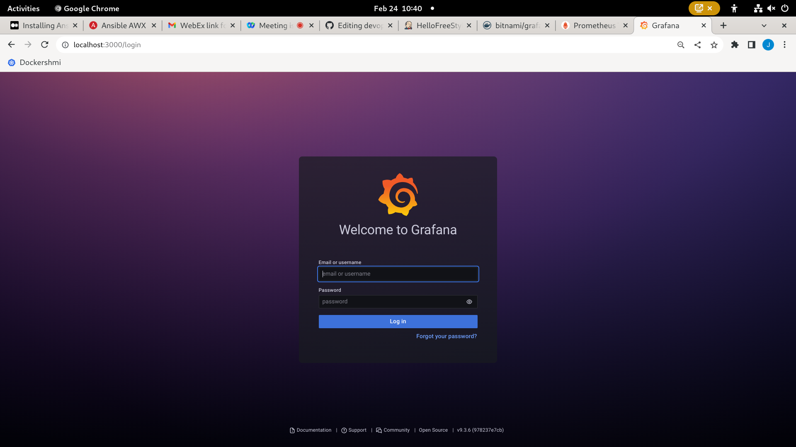
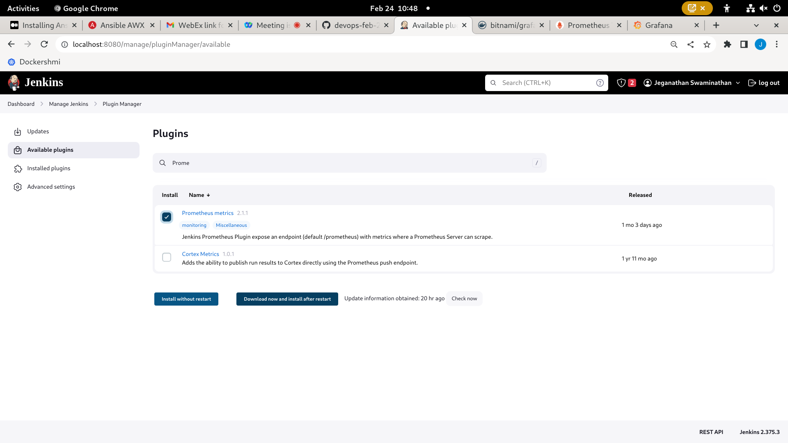
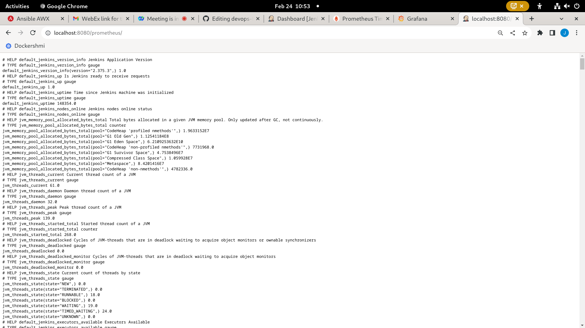

# Day 5

## Lab - Using Prometheus to collect Jenkins Performance metrics and plot the metrics using Grafana Dashboard

Create Prometheus as a Docker container
```
docker run -d --name prometheus-node1 --network host bitnami/prometheus:latest
docker ps
```

Expected output
<pre>
jegan@tektutor.org $ <b>docker run -d --name prometheus-node1 --network host bitnami/prometheus:latest</b>

Unable to find image 'bitnami/prometheus:latest' locally
latest: Pulling from bitnami/prometheus
edaa68e8bf3e: Pull complete 
Digest: sha256:12ab153b4c8330abb0dfb77f7dccf81056ac6953581b9bfde9b95f50af3a8edf
Status: Downloaded newer image for bitnami/prometheus:latest
3cbd4d6721213b152245599859ba7f4876563c8cf064572c4c09437907840425

jegan@tektutor.org $ <b>docker ps</b>
 
CONTAINER ID   IMAGE                       COMMAND                  CREATED         STATUS         PORTS                                   NAMES
3cbd4d672121   bitnami/prometheus:latest   "/opt/bitnami/promet…"   4 seconds ago   Up 2 seconds                                           prometheus-node1
</pre>

Accessing the Prometheus Dashboard on your RPS Ubuntu machine chrome web browsers
```
http://localhost:9090
```


## Lab - Starting Grafana as a Docker container
```
docker run -d --name grafana --network host bitnami/grafana:latest
docker ps

```

Expected output
<pre>
jegan@tektutor.org $ <b>docker run -d --name grafana --network host bitnami/grafana:latest</b>

9ddd5dd0307c26ad7f102c281a53f407926d614be62a9d8eab8c7976b46afcbc

jegan@tektutor.org $ <b>docker ps</b>
CONTAINER ID   IMAGE                       COMMAND                  CREATED         STATUS         PORTS                                   NAMES
9ddd5dd0307c   bitnami/grafana:latest      "/opt/bitnami/script…"   2 seconds ago   Up 2 seconds                                           grafana
3cbd4d672121   bitnami/prometheus:latest   "/opt/bitnami/promet…"   7 minutes ago   Up 7 minutes                                           prometheus-node1
</pre>

Accessing the Grafana Dashboard from your Lab machine chrome browser
```
http://localhost:3000
```

When it prompts for login credentials, you may type the below credentials
<pre>
username - admin
password - admin
</pre>

After first login, I changed the password to below credentials
<pre>
username - admin
password - Admin@123
</pre>



## Installing Prometheus Metrics Plugin in Jenkins


## Testing if Prometheus Jenkins Plugin is able to collect and expose the metrics


## Configuring prometheus to collect Jenkins metrics
```
cd ~/devops-feb-2023
git pull origin main

cd Day5/prometheus
docker cp prometheus-node1:/opt/bitnami/prometheus/conf/prometheus.yml .
```

Expected output
<pre>
jegan@tektutor.org $ cd ~/devops-feb-2023/Day5/prometheus

jegan@tektutor.org $ docker cp prometheus-node1:/opt/bitnami/prometheus/conf/prometheus.yml .
Preparing to copy...
Successfully copied 2.56kB to /home/jegan/devops-feb-2023/Day5/prometheus/.
</pre>


Add a new target in the prometheus.yml as shown below
<pre>
  - job_name: "jenkins"

    # metrics_path defaults to '/metrics'
    # scheme defaults to 'http'.
    metrics_path: "/prometheus"

    static_configs:
      - targets: ["localhost:8080"]
</pre>

Let's copy the prometheus.yml back into the prometheus container
```
cd ~/devops-feb-2023
git pull origin main

cd Day5/prometheus
docker cp prometheus.yml prometheus-node1:/opt/bitnami/prometheus/conf/prometheus.yml
docker restart prometheus-node1
docker ps
```

Expected output
<pre>
jegan@tektutor.org $ <b>docker cp prometheus.yml prometheus-node1://opt/bitnami/prometheus/conf/prometheus.yml</b>
Preparing to copy...
Copying to container - 0B
Copying to container - 0B
Copying to container - 512B
Copying to container - 1.638kB
Copying to container - 2.048kB
Copying to container - 2.56kB
Copying to container - 3.072kB
Successfully copied 3.072kB to prometheus-node1://opt/bitnami/prometheus/conf/prometheus.yml

jegan@tektutor.org $ <b>docker restart prometheus-node1</b>
prometheus-node1

jegan@tektutor.org $ <b>docker ps</b>
CONTAINER ID   IMAGE                       COMMAND                  CREATED          STATUS          PORTS                                   NAMES
9ddd5dd0307c   bitnami/grafana:latest      "/opt/bitnami/script…"   36 minutes ago   Up 36 minutes                                           grafana
3cbd4d672121   bitnami/prometheus:latest   "/opt/bitnami/promet…"   43 minutes ago   Up 8 seconds                                            prometheus-node1
</pre>

